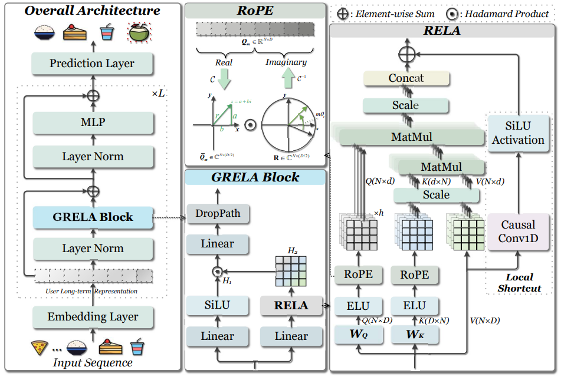

# RecGRELA

This repository contains the reference code for the paper **Gated Rotary-Enhanced Linear Attention for Long-term Sequential Recommendation**.

## 1. Overall
<p align="center">
    
  </p>

### 2. Requirements

Here are our main environment dependencies for running the repository：
- NVIDIA-SMI 535.183.01
- cuda 12.2
- python 3.11.5
- pytorch 2.4.0
- recbole 1.2.0
- casual-conv1d 1.4.0
- timm 1.0.11

### 3. Datasets

ML-20M, and Netflix datasets can be downloaded from [RecSysDatasets](https://github.com/RUCAIBox/RecSysDatasets). ML-32M can be found at [MovieLens](https://grouplens.org/datasets/movielens/) and processed by [conversion tools](https://github.com/RUCAIBox/RecDatasets/tree/master/conversion_tools).

### 4. Run

```
python run_RecGRELA.py
```


## Acknowledgment

Our code references [RecBole](https://github.com/RUCAIBox/RecBole), [Mamba4Rec](https://github.com/chengkai-liu/Mamba4Rec), and [Causal-Conv1d](https://github.com/Dao-AILab/causal-conv1d). We appreciate their outstanding work and open source. 
